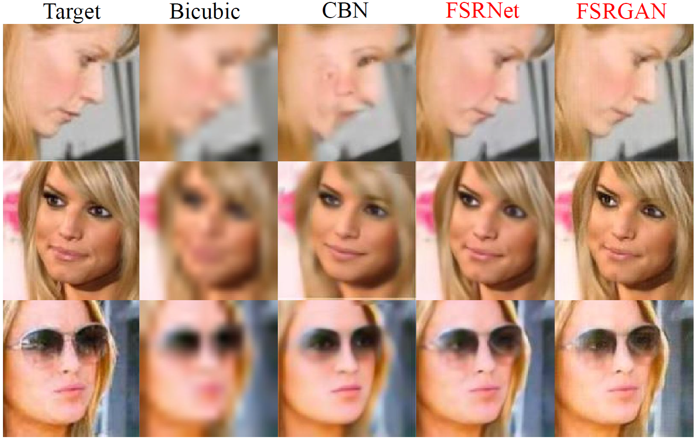
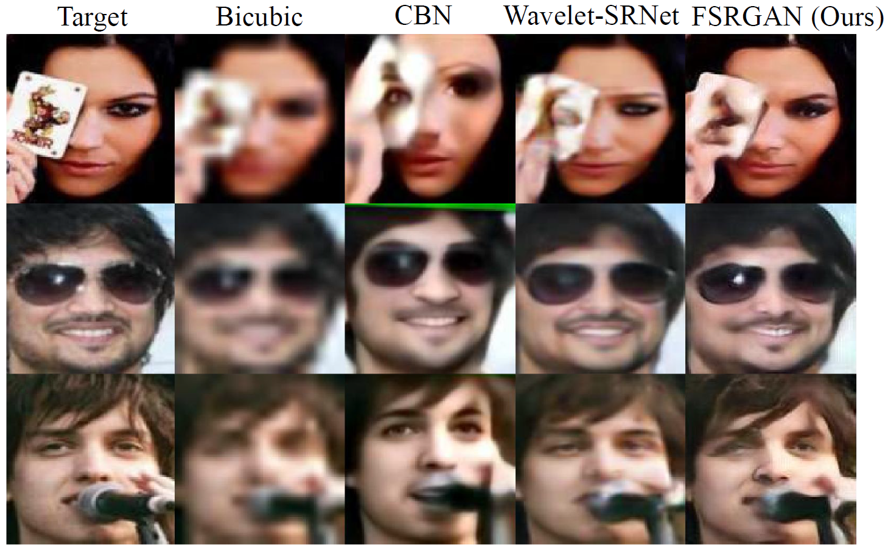
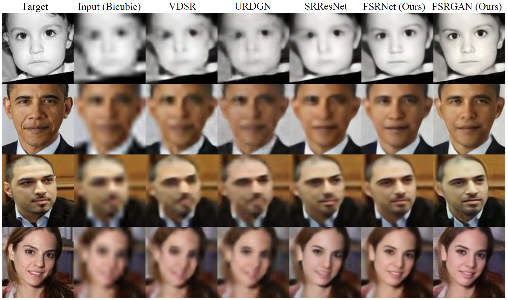
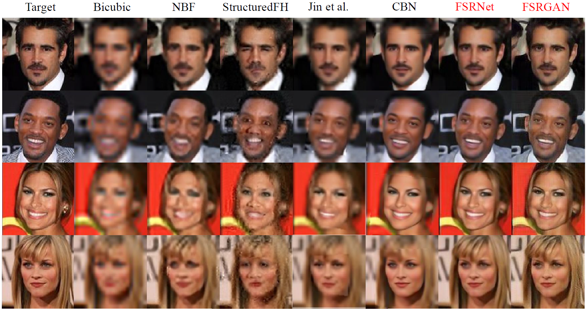

# FSRNet
### [[Paper]](https://drive.google.com/open?id=10i2NZfUyf2Yold4ABusz3Que-XN_gEEu) [[Demo]](https://tyshiwo.github.io/projects/faceSR.gif)

### Citation
If you find FSRNet useful in your research, please consider citing (* indicates equal contributions):

	@inproceedings{CT-FSRNet-2018,
	  title={FSRNet: End-to-End Learning Face Super-Resolution with Facial Priors},
	  author={Chen, Yu* and Tai, Ying* and Liu, Xiaoming and Shen, Chunhua and Yang, Jian },
	  booktitle={Proceedings of the IEEE Conference on Computer Vision and Pattern Recognition},
	  year={2018}
	}
  
## Setup

Clone the github repository:

```bash
git  clone https://github.com/tyshiwo/FSRNet.git
cd FSRNet
```

## Usage

For dataset CelebA:

```bash
sh test_CelebA_8x.sh 
```

For dataset Helen:

```bash
sh test_Helen_8x.sh 
```

## More Qualitative results
 

 

 

 


